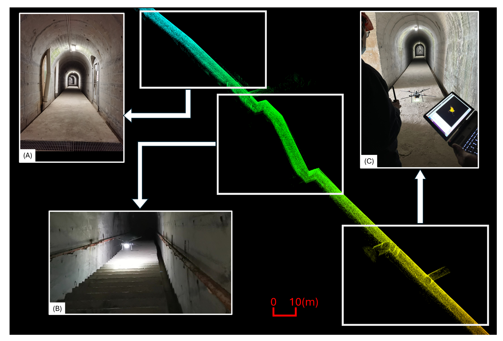

# LOFF: LiDAR-and-Optical-flow-fusion-odometry
## 1. Introduction
LOFF is an effective LiDAR SLAM and optical flow odometry fusion method designed to provide robust and accurate pose estimation in challenging environments, such as long-distance tunnels. Unlike traditional Kalman filters, we use a direction-separated data fusion method to avoid the pose estimation being affected by the noise from LiDAR SLAM in degeneracy environments.

<p align='center'>
   
</p>

### 1.1 Related video
The performance of our approach is verified through real-world UAV experiments against the state of the art, as shown in [Youtube](https://youtu.be/ITytYCW8y5w).

### 1.2 Related paper
[LOFF: LiDAR and Optical Flow Fusion Odometry](https://www.mdpi.com/2504-446X/8/8/411)

### 1.3 Dependencies
The project's dependencies are mainly based on which LiDAR SLAM algorithm you select: 

- Ubuntu
- ROS1 (Noetic recommended)
- Eigen

### 1.4 Modify the code ( ***Necessary!***)
1.4.1 Modify the ROS topics you need to subscribe to.
Located at loff::loff(ros::NodeHandle node_handle) in `loff.cpp`(at about Line 35).

- `"/opticalflow_topic"`: The topic name of optical flow odometry. This data represents the distance from the begining to the present obtained by optical flow sensor.(geometry_msgs::Vector3)
- `"/Lidar_SLAM_topic"`: The topic name of LiDAR SLAM (For [DLIO](https://github.com/vectr-ucla/direct_lidar_inertial_odometry/) is :/robot/dlio/odom_node/pose). You can change to any other SLAM, such as [FAST-LIO](https://github.com/hku-mars/FAST_LIO), etc. (geometry_msgs::PoseStamped)
- `"/pose_correct_flag"`: The topic name of Lidar SLAM status. We have modified the code of Lidar SLAM so that when it's in a degeneracy environment, it will continue to publish `False` and otherwise `True`. (std_msgs::Bool)

### 1.5 Compiling
Clone the repository and compile using the catkin_tools via:

```sh
cd ~/catkin_ws/src
git clone https://github.com/0RayZhang0/LOFF-LiDAR-and-Optical-flow-fusion-odometry.git

cd ../
catkin_make
source devel/setup.bash
```
### 1.6 Execution
```sh
roslaunch lidar_opticalflow_fusion loff.launch
```

### 1.7 Citation
```sh
@Article{drones8080411,
   AUTHOR = {Zhang, Junrui and Huang, Zhongbo and Zhu, Xingbao and Guo, Fenghe and Sun, Chenyang and Zhan, Quanxi and Shen, Runjie},
   TITLE = {LOFF: LiDAR and Optical Flow Fusion Odometry},
   JOURNAL = {Drones},
   VOLUME = {8},
   YEAR = {2024},
   NUMBER = {8},
   ARTICLE-NUMBER = {411},
   DOI = {10.3390/drones8080411}
}
```

### 1.8 Acknowledgements
We thank the authors of [DLIO](https://github.com/vectr-ucla/direct_lidar_inertial_odometry/), which is a high-performance Lidar SLAM with a clear and well-structured code framework. We highly recommend using it.
